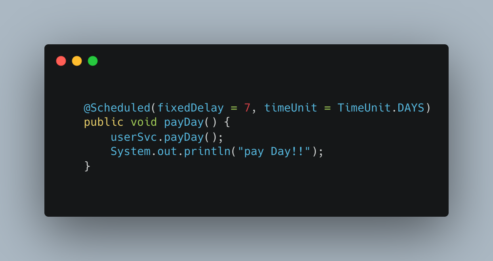

## Daily Trainer FinalProject

#Description

For our final project to culminate the completion of our learning experience at Skill Distillery full-stack software development course, our team of developers created an investing website application that allows users to create an account and trade stocks with simulated money allowing people to gain experience trading and investing in securities making real buy and sell orders and tracking their accounts performance over time.

The motivation for this project comes from personal interactions with friends who have stated that they have always wanted to get started with investing and either didn't have the money to spare or they didn't feel like they had the knowledge and experience to get started on their own. This application allows them to get experience buying and selling stocks without having to risk any of their own money, allowing them to track their performance over time while gaining experience in different trading and risk strategies. This way a user can fail multiple times and learn from their mistakes giving them exposure to various errors and pit falls with zero risk. When the user finally feels ready to invest with real money they will be confident that they know what they are doing and have simulated multiple investments before.

The application has social interaction features to it as the website allows users to see other users trades and write comments connected to them as well as compare their performance to that of their peers. Account holders have access to a leaderboard that displays users ranked in order by top performance computed by largest account balance.

When an account holder logs in he/she is brought to a dashboard that displays total account balance as well as a pie chart displaying his current holdings calculated by percentage size of total account balance. On this page is also displayed all of the users past trades and cost averages.

The site implements an API linking real daily stock price movement and charts from Yahoo finance. This way each trade transaction and resulting account balance movement mimics as it would if the user were placing identical trades with real money with a brokerage bank.

---
#Key Features

* Main Dashboard- Users personalized account data

* Settings- Allows user to update profile information

* Top Movers- Page that displays the top 10 stock gainers and top 10 stock decliners of the previous day

* Make a trade- Page for individual Stock with interactive candle stick chart and data. Form for user to buy/sell

* Leader Board- Hierarchical display that ranks users with the most profitable accounts

* Friends- Page that gives access to other users Profile picture, name and Biography

* Crud- Create,Delete,Edit users

---
#Lessons Learned

This was our first project implementing Angular technology with TypeScript. It was a good learning experience creating a second full-stack application utilizing different technologies than our midterm Projects which was created entirely on Spring Tool Suite by utilizing JSPs. This project also allowed us the opportunity to learn how to implement an API that gives us the ability to incorporate and display constantly changing data from the internet.

Another new lesson learned while working on this project was how to implement a scheduled deposit of money every week into all accounts using the @Scheduled annotation in the User controller file with a fixedDelay number correlated to the amount of days in TimeUnit.DAYS designating the time gap to add additional funds into an account

---
#Key Technologies Used

* Angular - TypeScript
* Java
* JavaScript
* CSS
* HTML
* MySQL Workbench
* SpringBoot
* Bootstrap
* Atom
* Hibernate
* GitHub
* MySQL
* Tomcat 8
* MAMP
* AWS
* Google
* Spring Tool Suite 4
* Trello
* Figma
* Slack
* Zoom
* Gradle
* Google Drive Terminal
* Object-Relational Mapping (ORM)
* Object-Oriented Programming
* Test Driven Development using JUNIT Juniper
* Postman

---
# Code Highlights

---
# Meet the Team

Cecelia Guerrero

* Lead developer
* GitHub: https://github.com/Cagugu
* LinkedIn: https://www.linkedin.com/in/cecelia-guerrero/

Anthony Butler

* Database Administrator/ Senior developer
* GitHub: https://github.com/anthonyb0824
* LinkedIn: https://www.linkedin.com/in/anthony-tyler-butler/

Miguel Barrios

* Repository Owner/ Senior developer
* GitHub: https://github.com/MiguelBarrios
* LinkedIn: https://www.linkedin.com/in/miguelbarriosdavila/

Daniel Kregstein

* Chief Concept Officer/ Senior developer
* GitHub: https://github.com/Akregstein
* LinkedIn: https://www.linkedin.com/in/daniel-kregstein-364883240/
